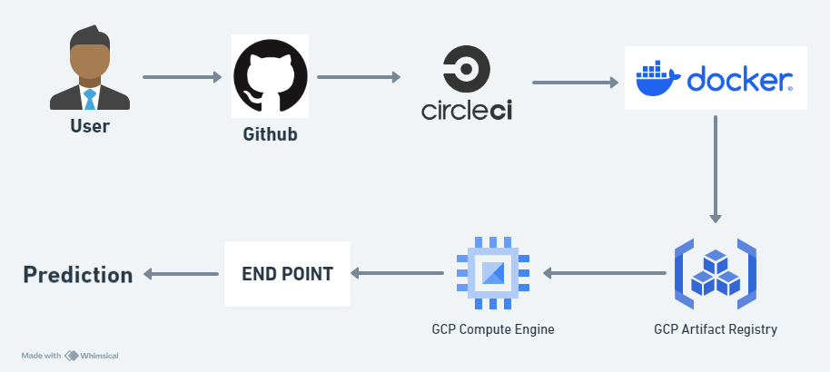

# Hate Speech Detection

## Introduction

This project focuses on building a deep learning model to detect hate speech in twitter data. Utilizing a robust CI/CD pipeline with CircleCI and Google Cloud Platform (GCP), the project aims to deliver an efficient and scalable solution for hate speech detection.


## Problem Statement
Hate speech on social media and other platforms is a growing concern, posing significant challenges to maintaining a safe online environment. This project aims to develop an automated system to accurately identify and filter out hate speech from text, thereby promoting a healthier and more respectful digital space.

## Dataset

Dataset using Twitter data, isused to research hate-speech detection. The text is classified as: hate-speech, offensive language, and neither. Due to the nature of the study, it’s important to note that this dataset contains text that can be considered racist, sexist, homophobic, or generally offensive.

[Link for dataset](https://drive.google.com/file/d/1Csf-4_Jb4MNmnEEw0eVDyMg-Xjr0l1CQ/view?usp=sharing)


## Prerequisites

- Python 3.9 or higher
- Fast API
- Docker
- Circle CI
- Google Cloud SDK
- Google Cloud Platform(GCP) Account

## Project CI/CD Workflow


### Installation
1. **Clone the repository**
    ```bash
    git clone https://github.com/Komalsai234/Hate-Speech-Detection.git
    ```

2. **Create a new conda environment**
    ```bash
    conda create -p hate-speech python==3.9 -y
    ```

3. **Install dependencies**
    ```bash
    pip install -r requirements.txt
    ```
4. **Configure the Google CLI in the terminal**
    
Install the gCloud CLI and then run below command in terminal then enter the required account information
  ```bash
    gcloud init
```


5. **Execute the Project pipeline**

    Run the `main.py` script to execute the Pipeline
    ```bash
    python main.py
    ```

6. **Start the Fast API Application**
   
   Run the `app.py` script to start the Streamlit web application.

    ```bash
    python app.py
    ```
7. **Interact with the Application**

    Open your web browser and go to the local Fast API URL (usually `http://localhost:8080`)
